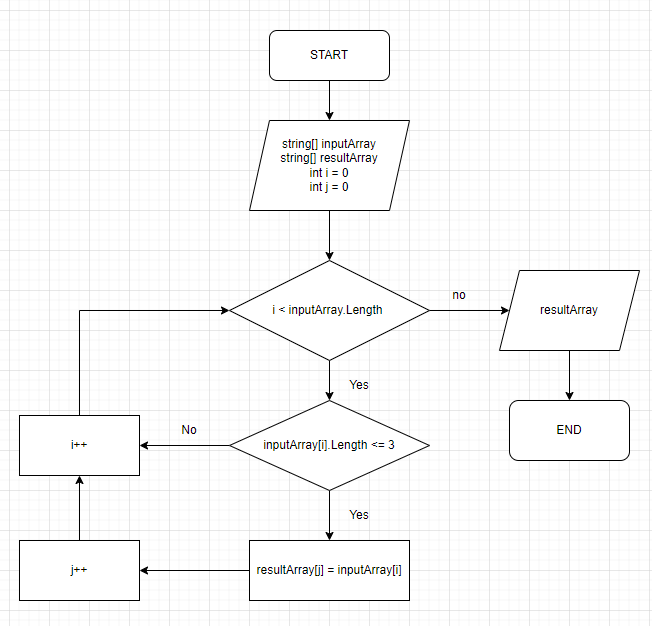

# Урок 1. Контрольная работа
1. Создать репозиторий на GitHub
2. Нарисовать блок-схему алгоритма (можно обойтись блок-схемой основной содержательной части, если вы выделяете её в отдельный метод)
3. Снабдить репозиторий оформленным текстовым описанием решения (файл README.md)
4. Написать программу, решающую поставленную задачу
5. Использовать контроль версий в работе над этим небольшим проектом (не должно быть так, что всё залито одним коммитом, как минимум этапы 2, 3, и 4 должны быть расположены в разных коммитах)

*Задача: Написать программу, которая из имеющегося массива строк формирует новый массив из строк, длина которых меньше, либо равна 3 символам. Первоначальный массив можно ввести с клавиатуры, либо задать на старте выполнения алгоритма. При решении не рекомендуется пользоваться коллекциями, лучше обойтись исключительно массивами.*

# Решение задач:
* Нарисовал блок-схему алгоритма, вставил скриншот в файл ReadMe и добавил в репозиторий файл Scheme.drawio.

# Логика работы программы:
* Пользователь вводит элементы массива через запятую;
* Программа считывает введенную строка и разбивает ее на массив строк через метод **EnterArray()**;
* Инициализируется переменная **count**, равная 0 для подсчета строк, которые удовлетворяют условию - длина меньше 3 символов;
* Идет проход по каждому элементу массива **inputArray** и увеличивается **count** каждый раз, когда длина строки равна или меньше 3 символам;
* Создается новый массив **resultArray** размером с **count**;
* В методе **FilterArray()** идет проход по элементам массива **inputArray** и если длина строки меньше, либо равна 3, записывается в **resultArray**;
* Метод **PrintArray()** выводит результат.

# Финал:
* Написал программу на C#, решающую поставленную задачу;
* Добавил ее в отслеживаемые и закоммитил;
* Создал новую ветку в Git - newbranch и внес изменения в ReadMe для дальнейшего объединения;
* Подготовился для заливки всего в репозиторий через **git push**. 